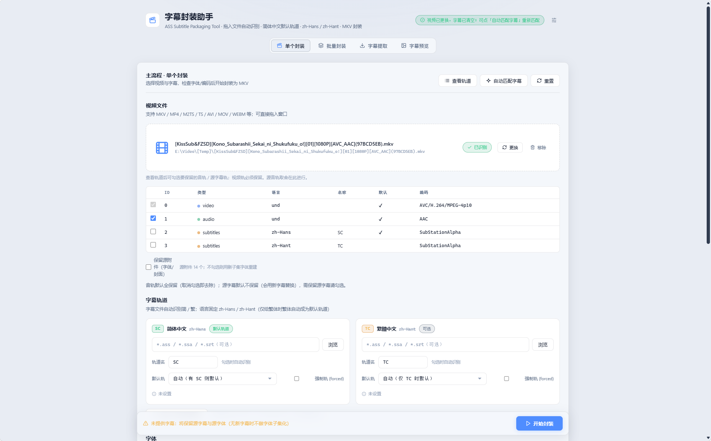
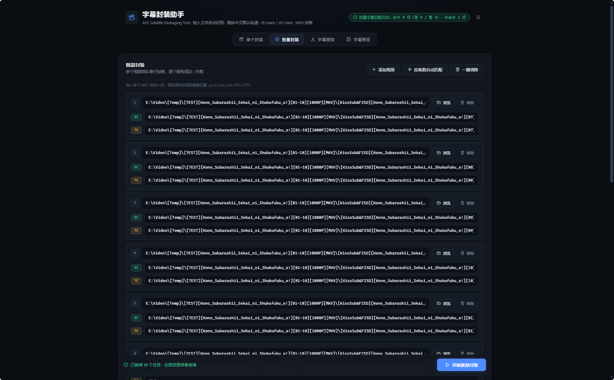

# Mux Deck · 字幕封装助手

用 mkvmerge 把 视频 + ASS 字幕 + 字体附件 合成 MKV 的本地工具：字体子集化（AssFontSubset 主用 / assfonts 回退）、字体体检、编码转换、预览帧、批量队列、内封轨道预览与提取，全部在浏览器界面完成。首次启动自动检测环境，缺失组件可直接在网页内一键下载安装。

## 界面预览

**单个封装**（浅色主题）：拖入视频自动识别、轨道取舍、简繁字幕与轨道旗标



**批量封装**（深色主题）：拖入整季 MKV 自动排队、按集数匹配简繁字幕



**便携部署**：整个文件夹拷走即用（Windows 10/11），服务端纯 Python 标准库。**仅需自行安装 Python 3.8+**（官方安装器勾选 Add to PATH），其余组件（MKVToolNix / ffmpeg / assfonts / AssFontSubset / fonttools）既可由 `安装环境.bat`（bootstrap）自动下载到 `bin/`，也可以在打开网页后于「环境检测」弹窗内一键安装。

## 快速开始

```powershell
# 0. 先安装 Python 3.8+（https://www.python.org/downloads/，勾选 Add to PATH）
# 1. 首次使用（或 bin/ 为空时）拉取运行时：
py -3 app\tools\bootstrap.py
#    需要代理： py -3 app\tools\bootstrap.py --proxy http://127.0.0.1:7890
#    或直接双击 安装环境.bat

# 2. 自检依赖（可选）：
环境自检.bat

# 3. 启动：
start_mux_ui.bat            # 浏览器自动打开 http://127.0.0.1:8765
```

**不跑 bootstrap 也行**：直接启动后，页面会自动检测环境，缺失的组件（mkvmerge / ffmpeg / 子集工具 / fonttools）会在「环境检测」弹窗里列出，填好代理（直连不通时）点「一键安装缺失组件」即可下载补齐，完成后自动重新检测、无需重启服务。系统已装 Python / MKVToolNix / ffmpeg 时程序按「自带 bin\ → 系统 PATH → 默认安装路径」自动回落。

## 功能

- **封装 (mux)**：mkvmerge 合成 MKV；简体存在时简体为默认轨道，仅给繁体时繁体自动默认
- **轨道旗标**：简/繁字幕轨可手动指定 `default`（默认轨）与 `forced`（强制轨），留空则走自动规则；封装后播放器按旗标选轨
- **封装预设**：轨道名 / 旗标 / 字体目录 / 输出 / 章节 / 命名模板 / MKV 标题 / 字体处理等一键保存为预设（面向字幕组规范）；**预设管理器**（右上角设置 → 封装 → 封装预设）双栏桌面布局：左侧列表区分「当前任务 ✓」与「正在编辑」两个状态，右侧分区编辑器（SC/TC 轨道卡、默认轨三态、路径浏览），底部按状态给出 应用 / 保存修改 / 保存并应用；主页状态条显示当前预设与已修改提示；**预设记忆**——刷新后自动恢复上次预设并重新套用，名称失效自动回落；已选预设时自动识别不改写轨道名，重置 = 回到预设基线
- **章节**：可选章节文件（OGM txt / XML）随封装写入并替换源章节；留空则保留源章节；内置**章节编辑器**（从源视频提取 / 加载文件 → OGM 明文编辑 → 保存回填）
- **命名模板**：输出文件名支持 `{src}` 源文件名、`{ep}` 集数、`{res}` 分辨率（如 1080P）、`{title}` MKV 标题（留空回退源文件名）占位符，单个与批量通用，提交前实时预览成品文件名
- **封装后校验 (QC)**：封装完成自动复检成品——字幕轨语言与默认旗标硬校验（不符即失败），附件数量/章节软提醒
- **快速修补**：mkvpropedit 原地修改已有 MKV 的轨道名称/语言/默认与强制旗标、MKV 标题、章节（XML）——秒级完成不重封装，发布后补丁场景专用
- **字体子集化（双轨）**：默认用 AssFontSubset——子集化后**自动修正 ASS 里引用的字体名**，根治嵌入字体名不匹配导致的缺字；assfonts 保留为回退（`config.json` 的 `subset_tool` 一行切换）。注意 AFS 要求字体目录内同族字体不重复，目录有重复时体检会给出明确提示；另有**仅收集模式**（不裁字形，把被引用字体全量嵌入）
- **字体体检 + 字体补给**：封装前检查字体缺失（含「字体存在但缺字形」）；缺字体时可一键从备份字体目录检索并复制进当前字体目录（自动校验同族样式不重复，补给后自动复检）
- **编码转换**：自动检测 GBK / BIG5 / UTF-16 并生成 UTF-8 副本（不改原文件）；歧义时按简/繁槽位判定
- **预览帧 / 连拍**：ffmpeg + libass 渲染指定时间点，或按字幕行自动抽 8 帧**拼成 4×2 网格图**（连拍带逐帧进度、可中途停止），一眼排查缺字/渲染问题；支持外部字幕（SRT 自动转 ASS）、**内封字幕轨**（自动抽取轨道与视频自带字体附件）与**双字幕 A/B 并排对比**。外部字幕模式的字体目录须与本程序同盘
- **轨道选择**：① 查看轨道 勾选源音轨/源字幕轨/保留附件；④ 外部音轨与源音轨**正交组合**
- **批量封装**：串行队列（**列表本地持久化，刷新/重启自动恢复续跑；失败项一键重跑；支持跳过已存在输出**）、按集数自动匹配字幕与章节（命中按简/繁汇报）、输出同名冲突拦截、无字幕项开始前确认、MKV 标题元数据、**逐集 QC 落盘汇总**（qc_report.json）
- **字幕提取**：mkvextract 提取，文件名以语言结尾（`EP01_track3.zh-Hans.ass`）
- **拖放识别**：按文件名 + 文件大小双匹配定位，歧义时弹出候选选择器（不再静默张冠李戴）
- **断线提示**：后端未运行时页面顶部显示横幅并每 3 秒自动探测，恢复后自动消失
- **环境检测与一键安装**：页面加载时自动检测 mkvmerge / ffmpeg / 子集化工具（AssFontSubset、assfonts）/ fonttools，缺失时自动弹出引导，可填代理并一键下载安装到 `bin\`（复用 bootstrap 逻辑，安装完成自动重新检测，免重启生效）；也可随时从右上角设置 →「环境检测 / 安装组件」打开
- **自动清理**：预览/临时文件 7 天过期；任务历史保留最近 100 条 + 30 天内记录

## 命令行入口（脱离界面单跑）

封装与批量功能自带 CLI（也是换工具时的隔离试验场），运维/测试工具同目录：

```powershell
py -3 app\tools\mux_cli.py --video V.mkv --sc-sub a.ass --fonts-dir Fonts   # 单任务封装
    常用可选参数：
      --tc-sub 繁体.ass              # 双语轨
      --chapters 章节.txt            # OGM txt / XML 章节文件（给出时替换源章节，留空保留源章节）
      --out-name "[组名] {ep} [{res}]"  # 输出命名模板（{src} 源文件名 / {ep} 集数 / {res} 分辨率）
      --title 成品标题               # MKV 标题元数据
      --fonts-mode collect           # 仅收集被引用字体全量嵌入（默认 subset 子集化）
      --out-dir D:\out --force --no-backup --sc-default 1 --sc-forced ...
py -3 app\tools\batch_cli.py --root "目录"                                 # 目录级批量（也可双击 app\tools\ass_subset_mux.bat）
py -3 app\tools\smoke_test.py                                              # 一键冒烟回归（服务运行时）
py -3 app\tools\font_dup_scan.py                                           # 字体目录重复扫描（AFS 口径）
py -3 app\tools\bootstrap.py                                               # 运行时引导（网页内「一键安装」复用同一逻辑）
py -3 app\tools\selfcheck.py                                               # 环境自检
py -3 app\tools\autostart.py install                                       # 开机自启
```

> 说明：字幕提取 / 预览帧 / 字体体检不再有独立 CLI——Web 内（features 模块）已有完整功能，界面即可完成。

## 目录结构

```
mux-deck/
├── app/                                       # 服务端：server.py 薄路由 + features/ 功能模块 + core.py 共享底座 + config.json
│   ├── features/                              # Web 功能模块（browse/files/tracks/mux/extract/preview/misc/fonts/env/subcheck/propedit/chapters）
│   ├── ui/                                    # 前端（零构建 vanilla JS，无打包器）：
│   │   ├── index.html + loader.js + init.js   # App Shell：壳 → loader 并行挂载 fragments 后按序注入脚本 → init.js bootstrap
│   │   ├── pages/ + partials/                 # 页面 fragment（single/batch/subtitle-tools）与共享 DOM（console/modals）
│   │   ├── scripts/{core,components,features}/# core 基础能力 → components 通用控件（modal/browser/settings/console）→ features 业务 UI（single/preflight/presets/chapters）
│   │   ├── styles/{components,features}/      # tokens/base/layout + 控件/业务样式，style.css 为 @import 入口
│   │   └── app.js 等根目录 js                 # 任务公共逻辑（task）/识别（identify）/批量/环境/提取/预览/修补页业务 + glue（app.js）
│   └── tools/                                 # 可独立执行的脚本/工具：mux_cli（封装引擎）/ batch_cli / bootstrap / smoke_test / selfcheck / font_dup_scan / autostart
├── tests/                                     # 三层测试：test_units.py（unittest）/ jsdom（整页回归）/ smoke（Playwright 冒烟，本地运行）
├── start_mux_ui.bat / install_autostart.bat / 安装环境.bat / 环境自检.bat   # 操作入口（根目录，纯 ASCII 薄壳）
├── bin/                                       # 第三方运行时（app\tools\bootstrap.py 获取，不随 git 分发）
│   ├── mkvtoolnix/                           # mkvmerge / mkvextract
│   ├── ffmpeg/                               # 含 libass（预览必需）
│   ├── assfonts/                             # 回退子集工具（v0.7.3）
│   └── assfontsubset/                        # 主用子集工具 AssFontSubset（v2.2.0）
├── data/                                     # 运行时数据：mux（任务历史）/ preview / log / tmp（旧 jobs/previews 只读兼容）
└── docs/                                     # 本地维护不入库：ARCHITECTURE.md（架构约束）/ PROGRESS.md（进度）/ PITFALLS.md（坑）/ CONTEXT.md（术语）/ adr/（决策）/ archive/（历史文献）
```

## 环境要求

| 组件 | 系统级 | bin/ 自带 | 说明 |
|---|---|---|---|
| Windows 10/11 | ✅ 必须 | — | 浏览器为系统内置 |
| Python 3.8+ | ✅ 自行安装 | — | 官方安装器勾选 Add to PATH |
| fonttools | ✅ pip 安装 | — | AFS 默认后端依赖（bootstrap 顺带安装，唯一 pip 包） |
| MKVToolNix | 可选 | ✅ v101.0 | 封装/提取/内封轨预览 |
| ffmpeg | 可选 | ✅ 9.0.1 | 预览；必须含 libass |
| AssFontSubset | 可选 | ✅ v2.2.0 | 主用子集工具，bootstrap 自动下载 |
| assfonts | 可选 | ✅ v0.7.3 | 回退子集工具，bootstrap 自动下载 |

以上组件均可在网页内「环境检测」弹窗中一键下载安装（见「快速开始」）；缺失时页面加载会自动弹出引导。

## 工作目录（扫描根）

「高级选项 → 工作目录」可切换拖放识别搜索的根目录（默认 `D:\Video`），持久化在 `config.json`。**首次启动**（未配置或配置失效）会强制弹出引导设置工作目录；可跳过，之后在「高级选项」随时补设。

## 许可与第三方声明

- 本项目代码以 **MIT 许可证** 开源（见 [LICENSE](LICENSE)）。
- 随附第三方二进制均为各自许可证分发：MKVToolNix（GPLv2，许可见其安装目录 doc/）、ffmpeg（LGPL/GPL 构建）、Python（PSF）、assfonts（许可见其自带 LICENSE.txt）。
- AssFontSubset 上游仓库未附带 LICENSE 文件，个人使用无妨；`bin/` 不进入 git 仓库，一律通过 `bootstrap.py` 从官方 Release 获取，本项目不二次分发其二进制。
